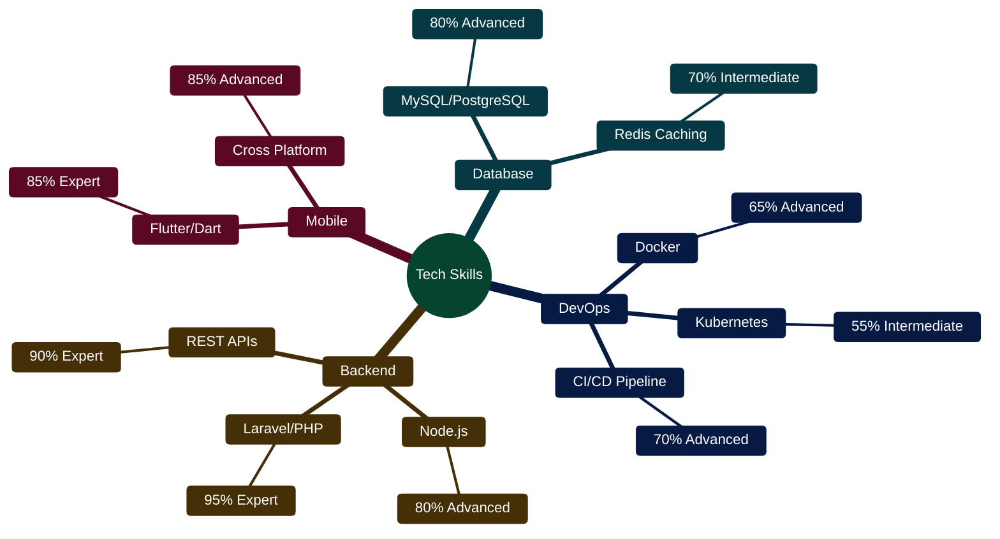
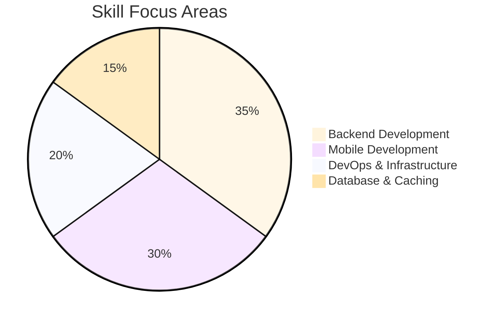

# 👋 Hi, I'm **@eliteio01**

🎯 **Backend Engineer | Mobile Developer | API & FinTech Specialist**

I'm a passionate software engineer with over **5 years of experience** building secure, scalable, and high-performance solutions across backend systems and mobile platforms. I love transforming complex challenges into clean, maintainable architectures that power **real-world products**.

---

## 🧠 **About Me**

- 💼 **Current Role:** Backend & Mobile Engineer at **Abia State Government House**, driving digital transformation through mobile and web solutions
- 🧩 Focused on **FinTech**, **API-first systems**, and **developer-friendly SDKs**
- ⚙️ Skilled in designing modular backends, efficient mobile apps, and cloud-native deployments
- 🧱 Advocate of clean architecture, security best practices, and CI/CD automation

---

## 🏗️ **Work Experience**

### 💼 **Abia State Government House — Mobile App Developer & Backend Engineer**
📍 *Umuahia, Nigeria | 2022 — Present*

- Led the development of mobile and web systems supporting state operations and public-facing apps
- Architected and deployed **secure REST APIs**, **user management systems**, and **payment integrations**
- Improved system reliability and performance through **Redis caching** and **Dockerized microservices**
- Collaborated with cross-functional teams to deliver digital transformation projects under tight timelines

---

## 🚀 **Tech Stack**

**Languages & Frameworks:**  
`PHP (Laravel)` • `Node.js` • `Dart (Flutter)` • `TypeScript` • `JavaScript`

**Databases & Tools:**  
`MySQL` • `PostgreSQL` • `Redis` • `Firebase`

**DevOps & Cloud:**  
`Docker` • `Kubernetes` • `AWS` • `DigitalOcean` • `GitHub Actions`

**Other Skills:**  
`RESTful APIs` • `GraphQL` • `Microservices` • `CI/CD` • `OAuth2` • `JWT` • `Stripe` • `Paystack`

---

## 📊 **Technical Proficiency**

---

## 📈 **Skill Distribution**

---

## 🔍 **Current Focus**

- Architecting **scalable fintech APIs** and **fraud detection systems**
- Building **mobile SDKs** and **developer-first infrastructures**
- Enhancing **system observability** and **fault-tolerant microservices**

---

## 🌱 **Currently Learning**

- ☁️ Cloud Infrastructure — *AWS, DigitalOcean*
- 🐳 Container Orchestration — *Docker, Kubernetes*
- 🔐 Advanced Security Engineering — *Zero Trust Models*

---

## 🤝 **Open to Collaborate On**

- Backend APIs & SDKs
- Mobile Apps (Flutter)
- Open Source Tools
- FinTech & Payment Platforms

---

## 📬 **Contact Me**

📧 **Email:** [etech.io02@gmail.com](mailto:etech.io02@gmail.com)  
🌐 **Website:** [https://laiki-tech.online](https://laiki-tech.online)  
💼 **LinkedIn:** [linkedin.com/in/eliteio](#)  
💻 **GitHub:** [github.com/eliteio01](https://github.com/eliteio01)

---

## 🧩 **Fun Fact**

> I love refactoring legacy systems into modular, modern architectures — it's like turning technical debt into digital gold. 🧠💡

---

⭐️ *"Great engineers don't just write code — they design experiences, reliability, and impact."*
